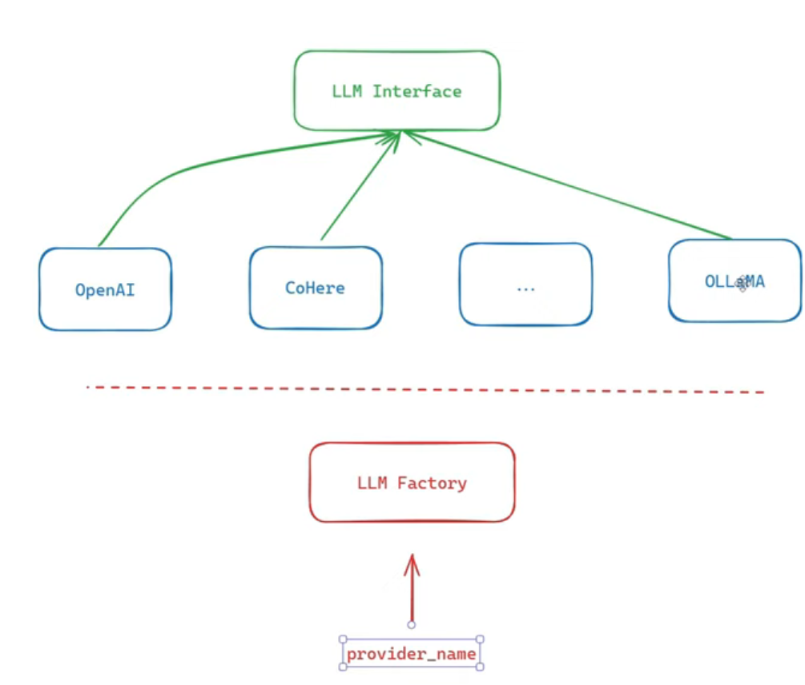

- To keep our project a longtime used (DURABLE) we use the "interface concept in the oop" as if we used diffrent llms compnies(openai,ollama,...) the all will use the same functions.

- the only differince is the setup we will use a design pattern called "Factory"
its a normal class contains all the logic of the logic so that we can use it when using any llm company/provider (openai,ollama,...)

 

- in the function called 
```
 def generate_text

```
each provider may has its own arguments in the generation (some model needs prompt , some of them we want to put on it max tokes . so we put all the args we think of and when we are using each provider we choose what args to give a value and what args will stay as default value .)

- for the function:
'''
 def construct_prompt(self, prompt: str, role: str = None): 
'''
 we reformate the prompt to be compatible with the model we choose 

- we can use OPENAI provider to use another providers .
```
from openai import OpenAI

```
we can use it for ollama as well , but when passing the key we pass also another arg called "url"

- we use loggers to easily identify any fault / faliuer in our system

- smell code : the code that is not used in the program and may make an error in the future 

-         ''' raise NotImplementedError ''' Acts as a  break as well but with a message to the user that this method is not implemented yet.

- '''text[:self.default_input_max_characters].strip()''' . strip is to remove the trailing spaces or /n

- LLMFactoryProvider.py is a file that contain a pattern disgen allowing us to easily create  (choose) a provider from the given provider classes(OpenAIProvider.py,CohereProvider.py,...)
#===================================LECTURE 16===============================

- Forces the output to be dict(used to convert any object to json)
'''
        return json.loads(
            json.dumps(collection_info, default=lambda x: x.__dict__)
        )
  '''  

-  Locales are a way to define language-specific resources (such as templates, messages, labels, and prompts) without hard-coding them in the application code. The locales folder should have the same structure and keys for every supported language. Each language file should contain the same entries, with only the translated values changing.

- sql alkeny is a lib used to deal with sql in python

- uui : universally unique id ; a random number used for Id as production instead of ecrimenting the id each time to hide how many projects are there.

- jsonB: json binary ; normal json is stored as a string when needing it its converted into json object in the memory then returning it (high latency in reading) while jsonB is stored into binary instead of string(high latency in writing)

- Indexing in SQL is made to make searching faster. Instead of doing a linear search **O(n)** by iterating through the whole table to find a specific row, we use an index. You can imagine an index as a sorted data structure (trees usually )that contains pointers showing exactly where a specific element is located. So instead of scanning the entire table, the database follows these pointers to directly find the required data, making queries much faster O(log n).

- Data migration is the process of moving data from one system, storage location, or format to another while preserving its accuracy, completeness, and usability.

- alembic is a data migration tool that automatically checks for the db , if the db bas table is not created then: it create one 
if its created : 
    make sure it follows the pydantic scheme

- after alembic changes the database it keeps a copy of the older one(same as most migration tools)

- 
